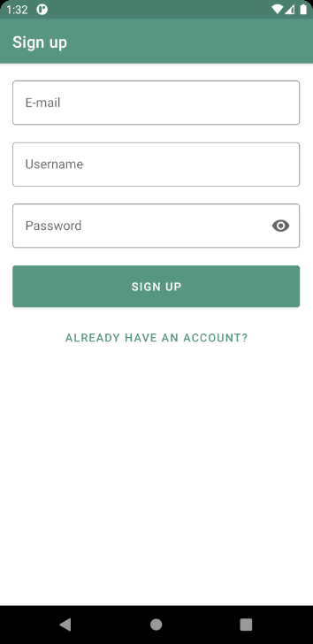
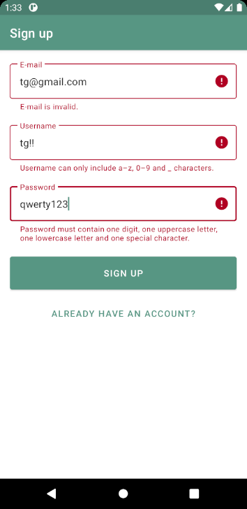
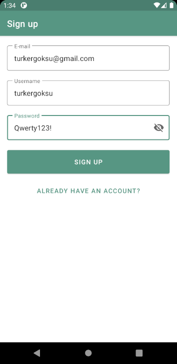

# 🛒Succulent Shop
Succulent Shop is a project we are building during bootcamp. This repository covers the first assignment of this project, the sign up screen.

The scope of this assignment includes designing the UI of sign up and verifying the user entered identifiers such as e-mail, username and password on the client side.

When the user does not enter the identifiers as desired, the error messages given in this [link](https://github.com/safaorhan/succulent-shop/issues/1) are displayed to the user.

You may reach the Figma designs from [here](https://www.figma.com/file/aKFn9Czmk2ms2hqp4sctcw/Succulent-Shop?node-id=0%3A1)

### ✨Screenshots

